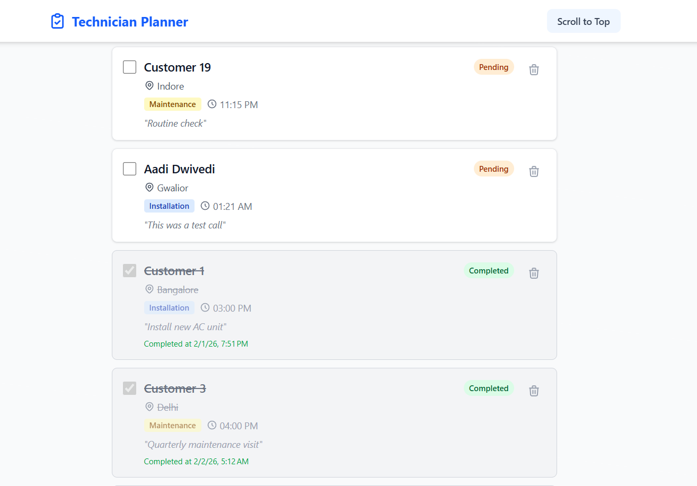
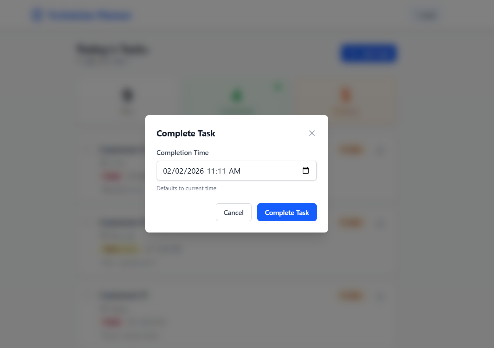

# 🛠️ Technician Planner

A full‑stack **Technician Daily Planner** application built to help field technicians efficiently schedule, track, and complete daily customer visits. The system provides a clean, responsive UI with real‑time task status tracking backed by a robust MEAN‑style backend.

---

## 📸 Application Screenshots

### Today’s Tasks Dashboard

Shows all tasks scheduled for today with clear visual distinction between **Pending** and **Completed** tasks.



---

### Complete Task Flow

When marking a task as completed, the technician is prompted to enter the **actual completion time** (defaults to current time).



---

### Add New Task

A dedicated form to schedule customer visits with validation for all required fields.


---

## 🚀 Features

### ✅ Dashboard

* Displays **Total**, **Completed**, and **Pending** task counts
* Auto‑updates based on task status

### 🗂️ Task Management

* Create tasks with:

  * Customer Name
  * Location / Address
  * Task Type (Installation, Repair, Maintenance, Inspection)
  * Scheduled Time
  * Optional Notes
* Tasks instantly appear in today’s list

### ⏱️ Task Completion

* Checkbox to mark task as completed
* Captures **actual completion time**
* Completed tasks are visually muted and moved below pending tasks

### 🎨 UI / UX

* Clean, minimal interface
* Color‑coded statuses (Pending / Completed)
* Fully responsive (mobile‑friendly)

---

## 🛠️ Tech Stack

### Frontend

* **Angular 21**
* **TypeScript**
* **Tailwind CSS**
* Angular Router with lazy‑loaded feature modules

### Backend

* **Node.js**
* **Express.js**
* **MongoDB** with Mongoose
* **TypeScript**

---

## 📋 Prerequisites

Ensure the following are installed:

* **Node.js** (v22+ recommended)
* **MongoDB** (Local instance or MongoDB Atlas)
* **Angular CLI**

---

## ⚙️ Local Setup Guide

### 1️⃣ Backend Setup

```bash
cd backend
npm install
```

Create a `.env` file inside `backend/`:

```env
MONGO_URL=mongodb://localhost:27017/technician-planner
PORT=5000
FRONTEND_URL=http://localhost:4200
```

> If using local MongoDB, ensure `mongod` is running.

Start backend server:

```bash
npm run dev
```

Backend runs at: `http://localhost:5000`

---

### 2️⃣ Frontend Setup

```bash
cd frontend
npm install
```

Update API base URL:

`src/environments/environment.ts`

```ts
export const environment = {
  APP_URL: 'http://localhost:5000/api'
};
```

Start frontend server:

```bash
npm run dev
```

Frontend runs at: `http://localhost:4200`

---

## 📂 Project Structure

```text
Technician-Planner/
├── backend/
│   ├── src/
│   │   ├── config/
│   │   ├── controller/
│   │   ├── lib/
│   │   ├── models/
│   │   ├── routes/
│   │   └── services/
│   └── package.json
│
├── frontend/
│   ├── src/
│   │   ├── app/
│   │   │   ├── core/
│   │   │   ├── features/
│   │   │   ├── shared/
│   │   │   └── app.routes.ts
│   └── package.json
│
└── README.md
```

---

## 📜 NPM Scripts

### Backend

* `npm run dev` – Development mode (watch)
* `npm run build` – Compile TypeScript
* `npm start` – Run production build

### Frontend

* `npm run dev` – Serve Angular app
* `npm run build` – Production build

---

## 🌍 Deployment

### 🔗 Live URLs

* **Frontend (Vercel):** [https://technician-planner-frontend.vercel.app](https://technician-planner-frontend.vercel.app)
* **Backend (Render):** [https://technician-planner.onrender.com](https://technician-planner.onrender.com)
* **Database:** MongoDB Atlas (Free Tier)

> Frontend is configured to consume the deployed backend API.

